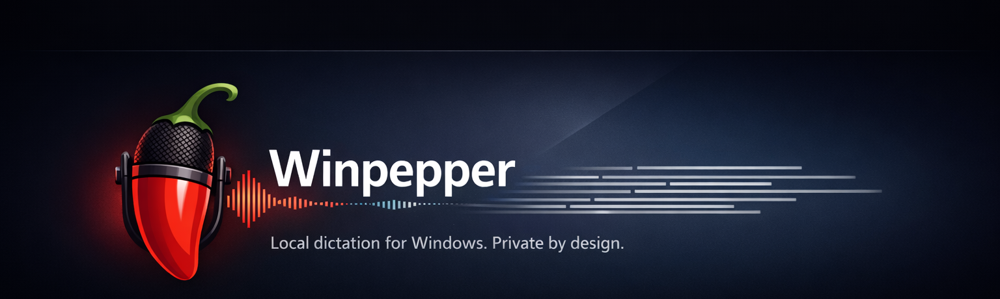

# Winpepper

Local, private voice dictation for Windows — hold a key, speak, and your words are typed into any app.

## Please read this first

Winpepper was written entirely by an AI agent. No human has ever tested it.

Every line of code, every test, every commit, and every document here — including
this page — was produced by an AI model across one long autonomous session. A
human approved the goal and the plan, but nobody has installed the app, clicked
around it, or spoken a sentence into it.

Here is what is known: the app builds, installs, uninstalls, starts up, and
reports a healthy idle state in its log on a test machine. Whether dictation
actually works on real hardware, with a real microphone, on a real desktop —
nobody knows yet. If you install this, you are the first person to find out.

So: try it, but don't depend on it for anything important yet. Bug reports are
genuinely useful. The [Windows Sandbox route](#try-it-risk-free) lets you try it
without touching your own PC.

<details>
<summary>What has specifically not been verified (click to expand)</summary>

The test machine had no microphone and no interactive desktop session — it was
driven entirely over a remote shell. So none of the following has been confirmed
by anyone, human or agent:

- a real microphone
- an interactive desktop session you can actually click into
- pressing Right Ctrl + Right Shift while speaking
- whether the app's screens render correctly
- whether the post-dictation learning prompts appear and behave
- whether the Lab (re-run a past dictation) panels work
- whether the model download screen works (the download code itself has automated tests)

The automated test suite does pass in full: 9 test projects, hundreds of tests,
no failures. That covers the logic, not the experience.

</details>

## Download and install

**[Download Winpepper for Windows (64-bit installer)](https://github.com/obra/winpepper/releases/latest/download/winpepper-x64.msi)**

If that link doesn't work, go to the
[latest release page](https://github.com/obra/winpepper/releases/latest) and click
the file ending in `.msi`.

### Steps

1. **Download** the `.msi` file using the link above. It will land in your
   Downloads folder.
2. **Double-click** the downloaded file to start the installer.
3. **Windows will show a blue "Windows protected your PC" box.** Click
   **More info**, then click **Run anyway**.
4. **Follow the installer.** It takes a few seconds. You will not be asked for an
   administrator password — Winpepper installs just for you.

#### Why does Windows warn me?

Because the installer is not signed with a paid certificate. Certificates cost
money every year, and Winpepper is a free, open-source project that doesn't have
one yet. Windows shows that same warning for *any* unsigned app, new or old,
harmless or not — it is not a virus alert, and it doesn't mean Windows found
anything wrong.

<details>
<summary>For the cautious: check the file is exactly what we published</summary>

Every release also includes a small `.sha256` file — a fingerprint of the
installer. Open PowerShell, run:

```powershell
Get-FileHash "$env:USERPROFILE\Downloads\winpepper-x64.msi" -Algorithm SHA256
```

and compare the result (ignoring upper/lower case) with the contents of the
`.sha256` file on the
[release page](https://github.com/obra/winpepper/releases/latest). If they match,
your download is byte-for-byte the file that was published.

</details>

### First launch: one download of the speech models

Winpepper does its listening on your own PC, so it needs to fetch the speech
files it thinks with — about 1.2 GB, once.

1. Start Winpepper from the Start Menu.
2. A short setup walks you through picking your microphone and your hotkey, and
   offers a **Download models** step. (You can also do this later from the
   **Models** tab: click **Download Missing Models**.)
3. Wait for the download to finish. You need an internet connection **only for
   this one download** — after that, Winpepper works fully offline. If the
   download is interrupted, it resumes where it left off.

Until the models are downloaded, Winpepper will tell you "Speech model not
installed. Open the Models tab to download it."

### How to dictate

Hold **Right Ctrl + Right Shift**, speak, then let go. A moment later your words
appear in whatever window you were typing in. Press **Esc** while it's working to
cancel.

That key combination is the default; you can record your own during setup. There's
also a second shortcut you tap once to start recording and tap again to stop, if
holding keys down isn't comfortable.

### What you need

- Windows 11, version 22H2 or newer
- A 64-bit PC (nearly all PCs)
- About 2 GB of free disk space (roughly 700 MB for the app, 1.2 GB for the
  speech models)
- A microphone
- A graphics card or chip that supports DirectX 12 — nearly all PCs from the last
  several years. Without one, Winpepper still works, just more slowly.

> Coming soon: `winget install obra.Winpepper`. The submission is under review by
> Microsoft; until it's accepted, use the download link above.

### How to uninstall

Open **Settings**, go to **Apps** > **Installed apps**, find **Winpepper**, and
choose **Uninstall**. No administrator password needed.

Your settings and dictation history are deliberately left behind so a reinstall
picks up where you left off. To erase those too, delete the folder
`%LOCALAPPDATA%\winpepper` (paste that into the File Explorer address bar).

## What it does

- **Types into any app.** Whatever window has your cursor — email, chat, browser,
  Word, a code editor — that's where the text lands.
- **Stays on your PC.** Your voice and your words are processed locally. No
  account to create, no subscription, no telemetry, nothing sent anywhere once
  the models are downloaded.
- **Cleans up what you said.** A small local language model adds punctuation and
  capitalization and trims the "um"s. If you'd rather have the raw transcript
  instantly, turn it off on the **Cleanup** tab.
- **Learns your vocabulary.** Add names, jargon, and words it keeps mishearing on
  the **Corrections** tab so it gets them right next time.
- **Keeps a history.** Review past dictations on the **History** tab, and re-run
  one through different settings on the **Lab** tab.
- **Lives in the tray.** It starts hidden with Windows and waits quietly for your
  hotkey.
- **Free and open source.** Apache License 2.0. Read the code, change it, keep it.

Optional: if you'd rather use a cloud speech service, there's built-in support for
AssemblyAI with your own API key. It's off by default — nothing goes to the cloud
unless you deliberately turn it on.

## Try it risk-free

Windows Sandbox is a feature built into Windows 11 that gives you a clean,
throwaway copy of Windows in a window — anything you install inside it disappears
when you close it, leaving your real PC untouched.

The scripts in [`scripts/windows-sandbox/`](scripts/windows-sandbox/) launch a
sandbox, install Winpepper inside it, run the self-test, and show you the result.
See [`scripts/windows-sandbox/README.md`](scripts/windows-sandbox/README.md) for
the one command to run.

One catch: Windows Sandbox has no microphone, so you can confirm the app installs
and starts, but not that dictation itself works.

## If something goes wrong

**Nothing happens when I hold the hotkey.** Check that Winpepper is running (look
for its icon in the system tray, near the clock), that the speech models finished
downloading (the **Models** tab), and that the right microphone is selected.

**The text takes several seconds to appear.** That's usually the cleanup step,
which leans on your graphics chip; it's much slower on built-in graphics than on
a dedicated graphics card. Turn off **Enable cleanup LLM** on the **Cleanup** tab
for near-instant results with slightly rougher text.

**Windows warned me the app is unrecognized.** Expected — see
[why above](#why-does-windows-warn-me). Click **More info**, then **Run anyway**.

**Something else is broken.** Open the **Diagnostics** tab and click **Copy
diagnostics bundle**. It creates a zip of logs and system information — never your
audio, never your transcripts — that's safe to attach to a bug report. Please file
one at [github.com/obra/winpepper/issues](https://github.com/obra/winpepper/issues).

## For developers

Winpepper is a single .NET 9 / WinUI 3 app: a low-level keyboard hook, WASAPI
audio capture, [NVIDIA Parakeet TDT v3][parakeet] speech recognition through ONNX
Runtime, a small local Qwen model for cleanup, and `SendInput` to type the result.

- [`docs/DEVELOPMENT.md`](docs/DEVELOPMENT.md) — architecture, repository layout,
  building from source (including the WinAppSDK XAML compiler workaround), known
  issues, and dev VM notes.
- [`docs/testing-windows-from-wsl.md`](docs/testing-windows-from-wsl.md) — running
  the full Windows test suite from a WSL2 checkout.
- [`docs/windows-smoke-test.md`](docs/windows-smoke-test.md) — the long-lived
  real-hardware release smoke test.
- [`docs/release.md`](docs/release.md) — the tag-triggered release process and
  winget submission.

[parakeet]: https://huggingface.co/nvidia/parakeet-tdt-0.6b-v3

## License and credits

Apache License 2.0. See [`LICENSE`](LICENSE). Copyright 2026 Jesse Vincent.

Companion to [`pepper-x`](https://github.com/obra/pepper-x) — same problem, a
native rewrite for Windows.
